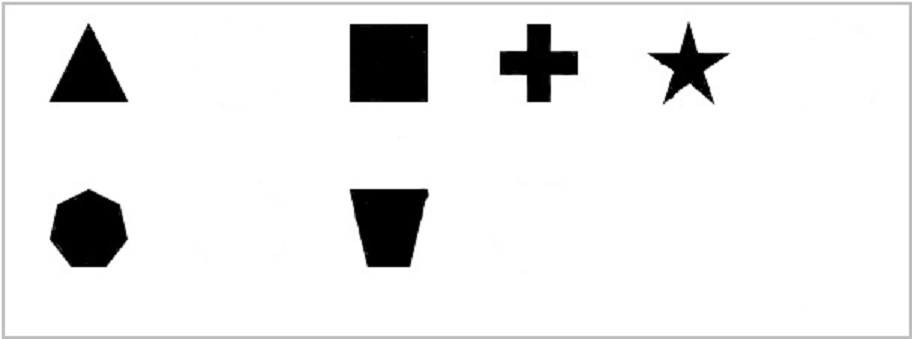
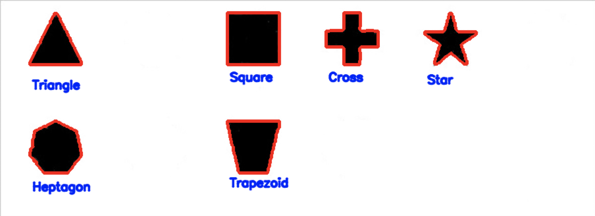

# Shape Recognition

This repo goes over creating an image processing pipeline to detect and classify shapes in an image. Each part is accompanied by a YouTube video which in linked below.

Part One\
[](https://youtu.be/ES2KBnE-Be8 "Part One")
Part Two\
[](https://youtu.be/qMU3oBcs6CQ "Part Two")
Part Three\
[](https://youtu.be/dDkPB-dF1QA "Part Three")

**Input Image**

**Output Image**


# How To Run

You can either install the requirements using your own python environment or use the `environment.yml` file to create a `shaperecognition` anaconda environment. From there just execute any part with python.

## 1. Using Your Own Python

### Manually install

```console
foo@bar:~$ git clone https://github.com/roboticperception/ShapeRecognition.git && cd shaperecognition
foo@bar:~$ pip install -r requirements.txt
foo@bar:~$ python tutorial_1.py
```

## 2. Using Anaconda

```console
foo@bar:~$ git clone https://github.com/roboticperception/ShapeRecognition.git && cd shaperecognition
foo@bar:~$ conda env create -f environment.yml
foo@bar:~$ conda activate shaperecognition
foo@bar:~$ python tutorial_1.py
```
